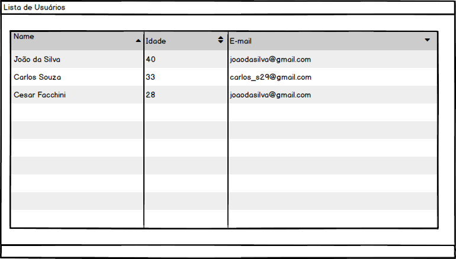
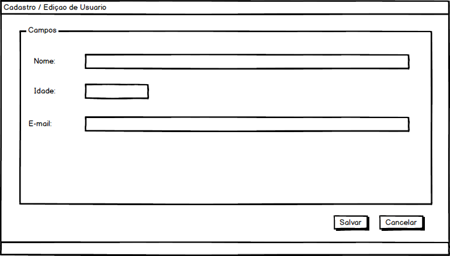

# Desafio Estagio Front-end da Ponto Sistemas

## A Vaga
Para se candidatar:  

- Conhecimento básico das tecnologias fundamentais da web (HTML, CSS, JavaScript e jQuery);
- Capacidade de comunicação, comprometimento e vontade de pôr a mão na massa;

## O Desafio
Para avaliar o seu conhecimento temos um desafio para você.
Você deverá criar um crud (acrónimo de Create, Read, Update e Delete) de cadastro de usuários.
O mesmo deve ser feito na linguagem que vocÊ preferir, o mesmo deve conter os campos abaixo:

-nome
-idade
-email

A aplicação deve permitir listar, cadastrar, editar e remover.

Segue abaixo algumas imagens como sugestão.

- Lista de Usuários

-Cadastro de Usuários

Você tem liberdade de desenvolve-lo como bem entender.

Os dados podem ser salvos em um banco de dados, um arquivo, localstorage.

Em caso de dúvidas entre em contato com adronilson@pontosistemas.com.br

OBS: ENVIAR UM BREVE TUTORIAL DE COMO INSTALAR / UTILIZAR A APLICAÇÃO

## Critérios de Avaliação

- Organização
- Semântica
- Decisões Técnicas
- Ferramentas Utilizadas

## Formas de Entrega

- E-mail
- Pull Request
- Link Repositório

## Tecnologias que utilizamos na Ponto Sistemas

-> Frontend
- CSS
- Html
- JavaScript

-> Backend
- Java
- Php
